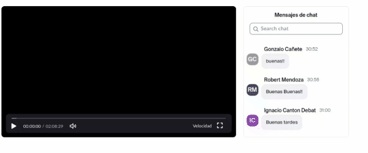

# Backend node

### Tech

## Descripción
A la hora de seguir la clase de coderhouse en zoom es complicado seguir el chat y las contestaciones del profesor con respecto al chat. asique realicé un script que emparda el chat con el reproductor de la clase para tener una experiencia más parecida a lo que fue la clase en su momento.

## Features

## Instalación (dos opciones)
### Opción 1: Pegar codigo en la consola de la página de zoom
- El código se puede inyectar en la consola cada vez que se quiera utilizar

### Opción 2: Inyectarlo mediante tampermonkey

- descargar tampermonkey de las extensiones de google chrome / firefox ó https://www.tampermonkey.net/
- abrir extensión tampermonkey
- dashboard -> importar -> main.js

`si utilizas adblock, dale exclusión a tampermonkey que no tiene publicidad y complica la subida del archivo main.js`